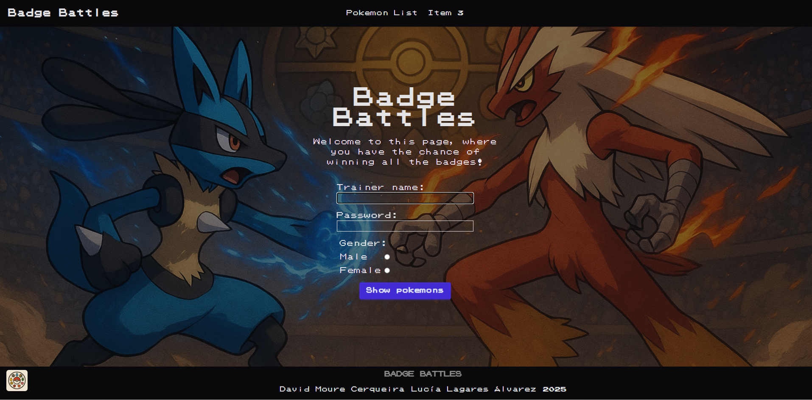
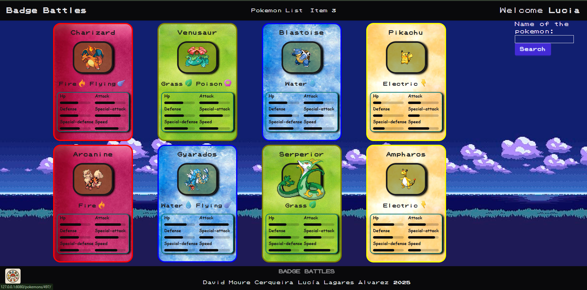
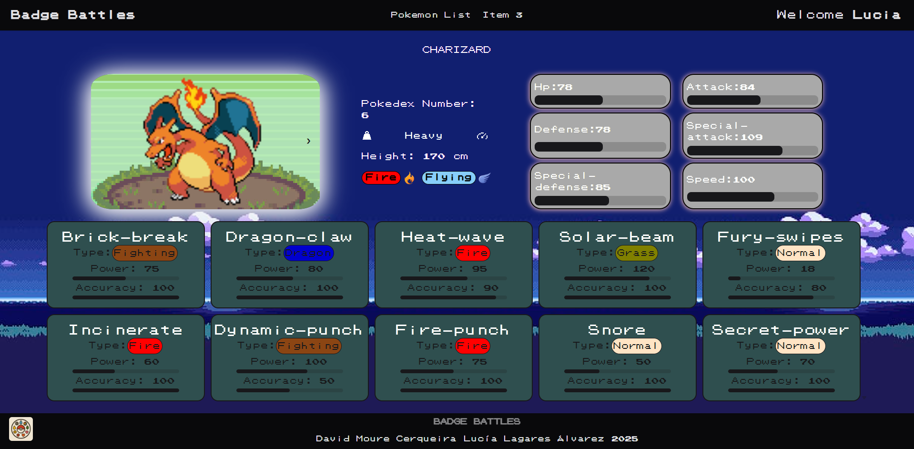
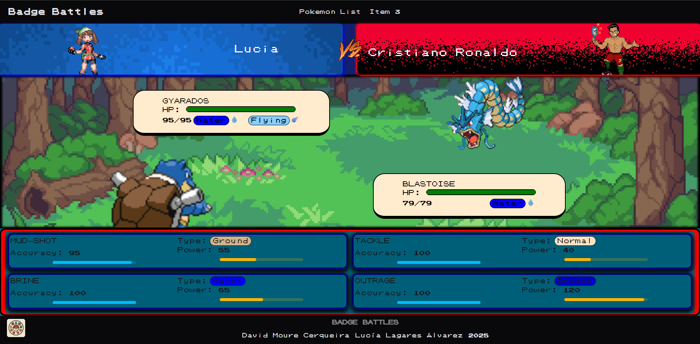
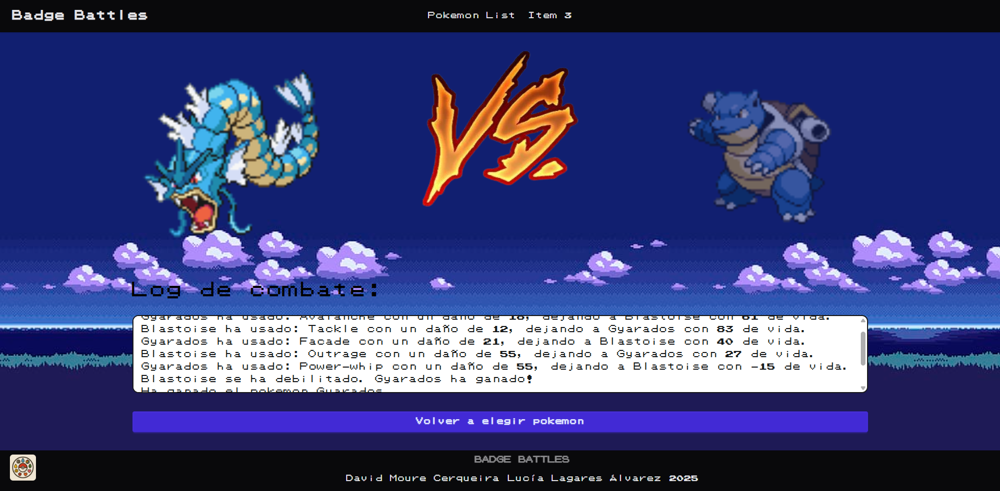

# __BadgeBattles__

## __Integrantes__

David Moure Cerqueira y Lucía Lagares Álvarez

## __Descripción y objetivo__

Aplicación de servidor que consiste en peleas entre pokemon, en la que para honrar el nombre del proyecto, con cada victoria se obtendrá una medalla hasta lograr el máximo de 8 medallas.

## __Instrucciones__

Será necesario para descargar este proyecto tener Python 3.13.7 y Flask 3.1.2

Crear entorno virtual usando python -m venv .venv

Instalar las dependencias con ./venv/Scripts/pip.exe install -r ./requirements.txt

Ejecutar el documento utilizando ./venv/Scripts/python -m app.main

Registrate  con tu nombre y género, haz click sobre la carta del Pokemon que te interesa para poder ver sus estadísticas, una vez decidas tu favorito, escribe su nombre en el buscador de la lista y disfruta de las batallas!

## __Vistas__

__Vista welcome:__

__Vista pokemon-list:__

__Vista pokemon-details:__

__Vista pokemon-battle:__

__Vista winner-page:__

## __Distribución__

Al mismo nivel de app esta almacenada la 'data' ya que en este momento utilizamos un JSON como base de datos, este está compuesto de un array de diccionarios en el que cada uno es un Pokemon diferente, del cual solo leemos información.

Dentro de app:

* __Templates__ contiene cada una de las vistas de la aplicación, se compone por un HTML base que contiene el header y footer, y cada una de las plantillas que hereda de esta completándola con su propio contenido.

* __Static__ contiene elementos estáticos como son en este caso, CSS, imágenes y fuentes (en nuestro caso hemos utilizado Tailwind y DaisyUI para el estilo del HTML).

* __Services__ contiene dos archivos los archivos  y .
    
    + __pokemon_service.py__ que contiene la lógica de obtención del listado de Pokemons, de un Pokemon o del valor de una stat:
        
        - __get_pokemons()__ 
        - __get_pokemon_by_id(id)__ 
        - __is_pokemon_shiny(id,max):__ 

            Partiendo del ID  hace raices cuadradas para reducirlo hasta lograr que sea menor que el max enviado (ayuda a controlar la probabilidad), y lo compara con un número aleatorio entre 0 y el máximo.
        - __get_pokemon_by_name(name)__ 
        - __get_stat_value(pokemon, stat_name)__ 

    + __battle_service.py__ que contiene la lógica de batalla, obtener cuál será el Pokemon enemigo, cuales serán los movimientos de cada Pokemon, creación de batalla y el combate:
        
        - __enemyPokemonSelector(my_pokemon)__
        - __random_moves(pokemon, moves)__
        - __create_battle(my_pokemon, enemy_pokemon, my_pokemon_moves):__ Crea el objeto batalla.
        - __attack(battle, option):__

            Se compara que Pokemon ataca primero y en función de la salida, ataca el rival o nosotros. Se evalua si el ataque impacta (booleano), se calcula el daño, se resta, se evalua si el Pokemon está vivo, en caso afirmativo le toca al rival, en caso contrario, se termina el combate.

        - __calculatePrecision(move):__ Booleano.
        - __enemyAttack(moves):__ Calcula que ataque usará el enemigo.
        - __write_log(battle, attacker, move, damage, reciever)__
        - __miss_log(battle)__
        - __winner_log(battle, ganador, perdedor)__
        - __calculate_HP_to_substract(attacker, reciever, move)__
        - __substract_HP(pokemon, damage)__
        - __evaluate_pokemon(hp)__
        - __rivalSpriteSelector()__

* __Routes:__ Está compuesta por 3 archivos que contienen todas las rutas de la aplicación, cada una de ellas tiene un Blueprint asociado al main para poder repartir las rutas en diferentes directorios:

    + + __home_routes.py:__
      - '/' que contiene la función __welcome()__, la cual es la página de bienvenida de la aplicación.  
        - __GET:__ Muestra el formulario donde el usuario debe registrarse indicando su nombre de entrenador y género.  
        - __POST:__ Valida que el nombre del entrenador tenga entre 3 y 15 caracteres.  
          - Si es válido, guarda el nombre y el género en sesión y redirige a la lista de Pokémon (`pokemon.pokemon_list`).  
          - Si no, muestra un mensaje de error en la plantilla `index.html`.

        - '/file' que contiene la función __file_json()__ para mostrar los datos del JSON en crudo.

    + __pokemon_routes.py:__
          - '/' que contiene la función __pokemon_list()__, la cual muestra la lista de Pokémon disponibles. Permite seleccionar un Pokémon mediante un formulario.  
          - Si el Pokémon existe, se guarda en sesión junto con un Pokémon enemigo, un rival y los movimientos aleatorios del Pokémon, redirigiendo al combate (`battle.pokemon_battle`).  
          - Si no existe, muestra un mensaje de error indicando que el Pokémon no está en la lista.

    + __pokemon_routes.py:__
        - Esta ruta contiene un verificador de login.
        - '/<int:pokemon_ID>/' que contiene la función __pokemon_details()__, la cual muestra los detalles de un Pokémon específico seleccionado por su ID y determina aleatoriamente si es shiny.
        - Renderiza la plantilla `pokemon_details.html` mostrando la información del Pokémon y si es shiny.

    + __battle_routes.py:__
        - Esta ruta contiene un verificador de login.
        - '/' que contiene la función __pokemon_battle()__, la cual gestiona la lógica de redireccionamiento del combate. 
        - Utiliza la función create_battle de battle_service para guardar en sesión el objeto de batalla.
        - __GET:__ Recupera los datos del Pokémon del jugador, sus movimientos y el enemigo desde la sesión. Si todos los datos están disponibles, crea la batalla y renderiza `pokemon_battle.html`. Si no, redirige a la lista de Pokémon.  
        - __POST:__ Procesa la acción seleccionada por el jugador mediante un formulario. Evalúa el resultado del ataque usando el servicio de batalla.  
          - Si hay un ganador o perdedor, se muestran los resultados en `pokemon_winner.html` incluyendo turnos y registro de la batalla.  
          - Al finalizar, elimina los datos de batalla y Pokémon de la sesión.

* __Repositories:__ Obtiene la información del JSON.

    +  __pokemon_repo.py:__ Obtiene los datos de los Pokemons del JSON
        - __get_pokemons()__ 
        - __search_by_id(id)__

* __Models:__ Contienen la clase de los objetos de pokemon y battle.

Hay una serie de archivos situados a primer nivel de app:
+   __colors:__ es un diccionario que asocia los tipos de los pokemons y sus ataques a nombres de colores
+   __decorators__ contiene el decorador de verificación de login.
+   __rivas__ contiene un diccionario con los nombres de los rivales y su imagen.

+   __main__ es donde se registran los blue prints, se configura las session y la contraseña, se inicia la extensión de sesiones.

